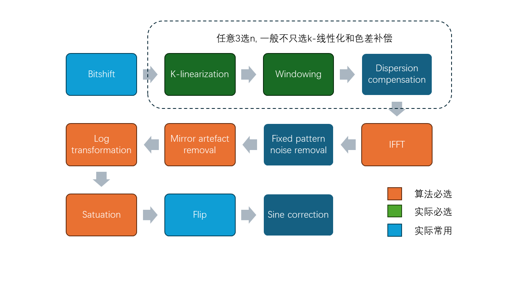
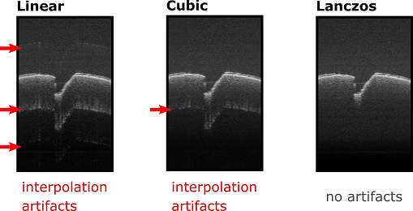

## 算法流程图：


1. **Bitshift** - 数据位移处理
2. **K-linearization** - K线性化处理
3. **Windowing** - 窗函数处理
4. **Dispersion compensation** - 色差补偿
5. **IFFT** - 快速傅里叶逆变换
6. **Fixed pattern noise removal** - 固定位置噪声移除
7. **Mirror artefact removal** - 镜像伪像移除
8. **Log transformation** - 对数变换
9. **Saturation** - 饱和处理
10. **Flip** - 图像翻转
11. **Sine correction** - 正弦校正

## 伪代码概述：

### Bitshift
- **输入**：原始数据数组
- **输出**：位移后的数据数组
- **功能**：根据输入的位深，将数据右移确定的位数。

```pseudo
function bitshift(data, bit_depth):
    if bit_depth <= 8:
        shift_amount = 4
    elif bit_depth <= 16:
        shift_amount = 8
    else:
        shift_amount = 10
    return data >> shift_amount
```

### K-linearization (具体不同的方法见下)
- **输入**：非线性K空间数据
- **输出**：线性化后的数据
- **功能**：根据K空间重新采样曲线进行插值处理。
- **参数**：c0, c1, c2, c3

**线性插值**:
```pseudo
function k_linearization_linear(data, resample_curve):
    for each index in data:
        x = resample_curve[index]
        x0 = floor(x)
        x1 = ceil(x)
        data_linearized[index] = data[x0] + (x - x0) * (data[x1] - data[x0])
    return data_linearized
```

**立方插值**和**Lanczos**方法类似，具体根据数学插值公式进行计算。

### Windowing (具体不同的窗函数见下)
- **输入**：线性化数据
- **输出**：窗函数处理后的数据
- **功能**：应用窗函数（实际常用Hanning window）以减少频谱泄漏。

```pseudo
function windowing(data, window_curve):
    for each index in data:
        data[index] = data[index] * window_curve[index]
    return data
```

### Dispersion Compensation
- **输入**：窗函数处理后的数据
- **输出**：色散补偿后的数据
- **功能**：根据色散曲线调整相位以补偿色散影响。
- **参数**：d0, d1, d2, d3

```pseudo
function applyDispersionCompensation(data, d0, d1, d2, d3):
    size = size_of(data)
    output_data = create_array(size)

    for index = 0 to size - 1 do:
        delta = index / (size - 1)
        correction = d0 + d1 * delta + d2 * delta^2 + d3 * delta^3
        output_data[index] = data[index] * correction

    return output_data
```

### IFFT
- **输入**：色散补偿后的数据
- **输出**：时域信号
- **功能**：执行快速傅里叶逆变换。
- **备注**：通常调用第三方库如cuFFT或FFTW进行实现。

### Fixed Pattern Noise Removal
- **输入**：IFFT后的数据
- **输出**：去除固定模式噪声的数据
- **功能**：采用最小方差算法移除固定模式噪声。

```pseudo
function fixed_pattern_noise_removal(data, segments):
    calculate_mean_and_variance_per_segment(data, segments)
    return data_corrected
```

### Mirror Artefact Removal
- **输入**：去噪后的数据(complex)
- **输出**：去除镜像伪像的数据(complex)
- **功能**：移除由于FFT带来的镜像伪像。

```pseudo
function mirror_artifact_removal(data):
    return data[0:length(data)/2]
```

### Log Transformation
- **输入**：去除镜像伪像的数据(complex)
- **输出**：取模、对数变换（可选）后的数据
- **功能**：取模，然后执行对数变换以增强图像对比度。

```pseudo
function log_transformation(data):
  if(log)
    return 10*log(magnitude(data))
  else
    return magnitude(data)
```

### Saturation
- **输入**：取模后的数据
- **输出**：饱和处理后的数据
- **功能**：将数据值限制在特定范围内，避免超出显示器能显示的范围。

```pseudo
function saturation(data, min_val, max_val，coeff, addend):
    for each index in data:
        data[index] = coeff*((data[index] - min) / (max - min) + addend)
        data[index] = saturatef(dara[index])  # 截断至[0.0, 1.0]
    return data
```

### Flip
- **输入**：饱和处理后的数据
- **输出**：翻转后的图像数据
- **功能**：根据需要翻转图像。

```pseudo
function flip(data):
    return data[::-1]
```

### Sine Correction
- **输入**：翻转后的图像数据
- **输出**：正弦校正后的数据
- **功能**：根据扫描镜的正弦运动进行校正。

```pseudo
function sin_correction(data, sinusoidal_resample_curve):
    corrected_data = interpolate(data, sinusoidal_resample_curve)
    return corrected_data
```

## K-linearization methods
There are currently three interpolation methods available: Linear, Cubic Spline (Catmull-Rom Spline), and Lanczos. These methods represent a trade-off between speed and accuracy, with Linear being the fastest and Lanczos being the most accurate. The figure below shows typical interpolation artifacts that can be seen when using the different interpolation methods:

### 线性插值 (Linear Interpolation)
- **输入**：复数输入数组 `in`，重采样曲线数组 `resampleCurve`
- **输出**：线性化后的复数输出数组 `out`
- **功能**：使用线性插值方法重新采样输入数据。

```pseudo
function klinearizationLinear(in, resampleCurve, width, samples):
    for each index from 0 to samples:
        j = index % width
        offset = index - j
        x = resampleCurve[j]
        x0 = floor(x)
        x1 = x0 + 1
        f_x0 = in[offset + x0].x
        f_x1 = in[offset + x1].x
        out[index].x = f_x0 + (f_x1 - f_x0) * (x - x0)
        out[index].y = 0  // 假设输入是实数
```

### 立方插值 (Cubic Interpolation)
- **输入**：复数输入数组 `in`，重采样曲线数组 `resampleCurve`
- **输出**：线性化后的复数输出数组 `out`
- **功能**：使用立方插值方法重新采样输入数据。

```pseudo
function klinearizationCubic(in, resampleCurve, width, samples):
    for each index from 0 to samples:
        j = index % width
        offset = index - j
        x = resampleCurve[j]
        n1 = floor(x)
        n0 = max(n1 - 1, 0)  // 避免越界
        n2 = n1 + 1
        n3 = n2 + 1
        f_y0 = in[offset + n0].x
        f_y1 = in[offset + n1].x
        f_y2 = in[offset + n2].x
        f_y3 = in[offset + n3].x
        out[index].x = cubicHermiteInterpolation(f_y0, f_y1, f_y2, f_y3, x - n1)
        out[index].y = 0
```

这里的 `cubicHermiteInterpolation` 是一个插值函数，它会根据输入的四个点和位置计算立方Hermite插值。这些方法适用于对OCT图像数据进行预处理，以使得数据在频域内更加均匀，从而提高后续处理步骤的质量和效果。

### Lanczos插值 (Lanczos Interpolation)
- **输入**：复数输入数组 `in`，重采样曲线数组 `resampleCurve`
- **输出**：线性化后的复数输出数组 `out`
- **功能**：使用Lanczos插值方法重新采样输入数据。

```pseudo
function klinearizationLanczos(in, resampleCurve, width, samples, a):
    for each index from 0 to samples:
        j = index % width
        offset = index - j
        x = resampleCurve[j]
        n0 = floor(x)
        sum = 0.0
        for k from -a + 1 to a:
            n = n0 + k
            if n >= 0 and n < width:
                sinc_x = sinc(pi * (x - n))
                sinc_ax = sinc(pi * (x - n) / a)
                window_value = sinc_x * sinc_ax
                sum += in[offset + n].x * window_value
        out[index].x = sum
        out[index].y = 0
```

在这个Lanczos插值中：
- **a** 是Lanczos窗口的大小，通常为2或3。
- **sinc** 函数定义为 \( \text{sinc}(x) = \frac{\sin(x)}{x} \)。
- 每个点的值是通过加权周围点的值计算得到的，权重由 `sinc` 函数和Lanczos窗函数提供。


## Window functions

### Rectangular Window
- **输入**：窗函数的总长度 `size`
- **输出**：矩形窗函数值的数组
- **功能**：生成矩形窗函数，中心位置由 `centerPosition` 和宽度由 `fillFactor` 决定。

```pseudo
function calculateRectangular():
    width = fillFactor * size
    center = centerPosition * size
    minPos = center - width / 2
    maxPos = minPos + width
    for i from 0 to size:
        xi = i - minPos
        xiNorm = xi / (width - 1)
        if xiNorm <= 0 or xiNorm >= 1:
            data[i] = 0
        else:
            data[i] = 1
```

### Hanning Window
- **输入**：窗函数的总长度 `size`
- **输出**：汉宁窗函数值的数组
- **功能**：生成汉宁窗函数。

```pseudo
function calculateHanning():
    width = fillFactor * size
    center = centerPosition * size
    minPos = center - width / 2
    maxPos = minPos + width
    for i from 0 to size:
        xi = i - minPos
        xiNorm = xi / (width - 1)
        if xiNorm <= 0 or xiNorm >= 1:
            data[i] = 0
        else:
            data[i] = 0.5 * (1 - cos(2 * PI * xiNorm))
```

### Gaussian Window
- **输入**：窗函数的总长度 `size`
- **输出**：高斯窗函数值的数组
- **功能**：生成高斯窗函数。

```pseudo
function calculateGauss():
    center = centerPosition * size
    for i from 0 to size:
        xi = i - center
        xiNorm = xi / (size - 1) / fillFactor
        data[i] = exp(-10 * xiNorm^2)
```

### Sine Window
- **输入**：窗函数的总长度 `size`
- **输出**：正弦窗函数值的数组
- **功能**：生成正弦窗函数。

```pseudo
function calculateSineWindow():
    width = fillFactor * size
    center = centerPosition * size
    minPos = center - width / 2
    maxPos = minPos + width
    for i from 0 to size:
        xi = i - minPos
        xiNorm = xi / (width - 1)
        if xiNorm <= 0 or xiNorm >= 1:
            data[i] = 0
        else:
            data[i] = sin(PI * xiNorm)
```

### Lanczos Window
- **输入**：窗函数的总长度 `size`
- **输出**：兰索斯窗函数值的数组
- **功能**：生成兰索斯窗函数。

```pseudo
function calculateLanczosWindow():
    width = fillFactor * size
    center = centerPosition * size
    minPos = center - width / 2
    maxPos = minPos + width
    for i from 0 to size:
        xi = i - minPos
        xiNorm = xi / (width - 1)
        argument = 2 * xiNorm - 1
        if xiNorm <= 0 or xiNorm >= 1:
            data[i] = 0
        else if argument == 0:
            data[i] = 1
        else:
            data[i] = sin(PI * argument) / (PI * argument)
```
